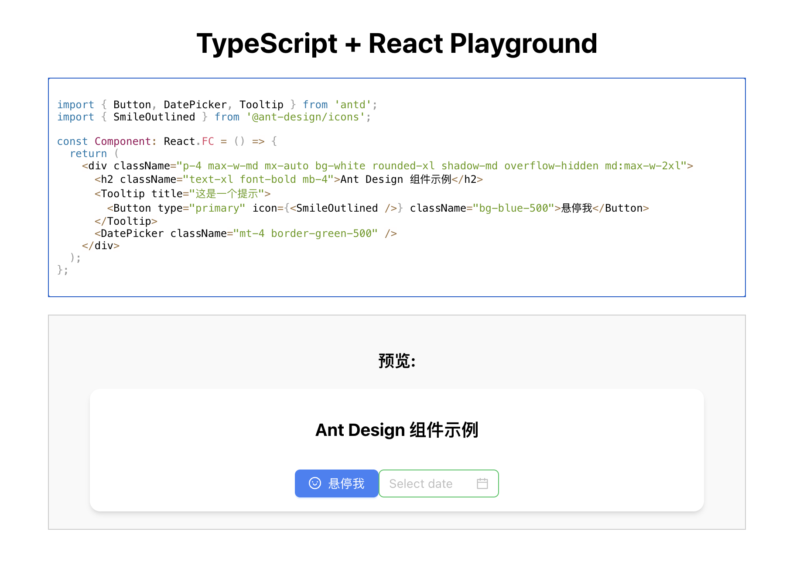

# Ant Design 5 + Tailwind CSS Playground

这是一个交互式的代码编辑器和预览工具,允许用户在浏览器中实时编写、编译和预览使用 Ant Design 5 和 Tailwind CSS 的 React 组件。

## 功能特点

- 实时代码编辑和预览
- 支持 TypeScript 和 JSX 语法
- 集成 Ant Design 5 组件库
- 支持 Tailwind CSS 样式
- 在 Shadow DOM 中渲染组件,确保样式隔离
- 使用 @twind/core 进行运行时 Tailwind CSS 处理

## 技术栈

- React
- TypeScript
- Ant Design 5
- Tailwind CSS
- @twind/core
- @monaco-editor/react
- Babel (用于实时代码转译)

## 使用方法

1. 在代码编辑器中编写您的 React 组件。
2. 使用 Ant Design 组件和 Tailwind CSS 类来设计您的 UI。
3. 实时预览您的组件在右侧的预览窗口中。

## 示例代码
可渲染的实例代码

```tsx
import { Button, DatePicker, Tooltip } from 'antd';
import { SmileOutlined } from '@ant-design/icons';

const Component: React.FC = () => {
  return (
    <div className="p-4 max-w-md mx-auto bg-white rounded-xl shadow-md overflow-hidden md:max-w-2xl">
      <h2 className="text-xl font-bold mb-4">Ant Design 组件示例</h2>
      <Tooltip title="这是一个提示">
        <Button type="primary" icon={<SmileOutlined />} className="bg-blue-500">悬停我</Button>
      </Tooltip>
      <DatePicker className="mt-4 border-green-500" />
    </div>
  );
};
```


## 注意事项

- Ant Design 的样式优先级高于 Tailwind CSS,这允许您在保持 Ant Design 组件外观的同时使用 Tailwind 进行轻量级自定义。
- 编写的组件必须以 `Component` 为组件名称。

## 本地开发

1. 克隆此仓库
2. 运行 `npm install` 安装依赖
3. 运行 `npm start` 启动开发服务器
4. 在浏览器中打开 `http://localhost:3000` 查看 Playground

## 其他

- 对于需要弹出层的组件(如 Tooltip、DatePicker 等), 为了正确渲染在 Shadow DOM 中，已经在`ConfigPrivider` 中使用 `getPopupContainer` 属性确保弹出层的样式准确。

